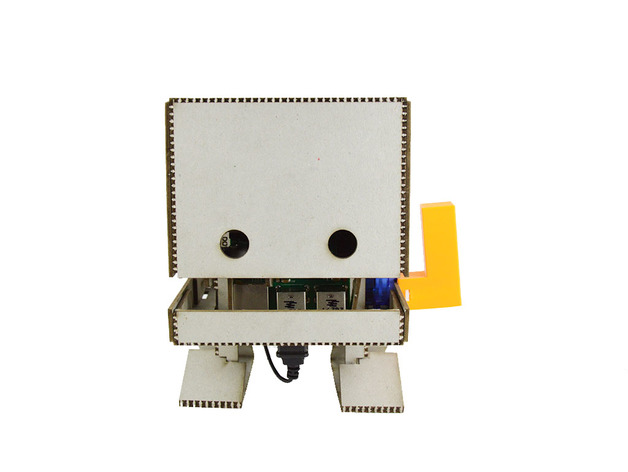
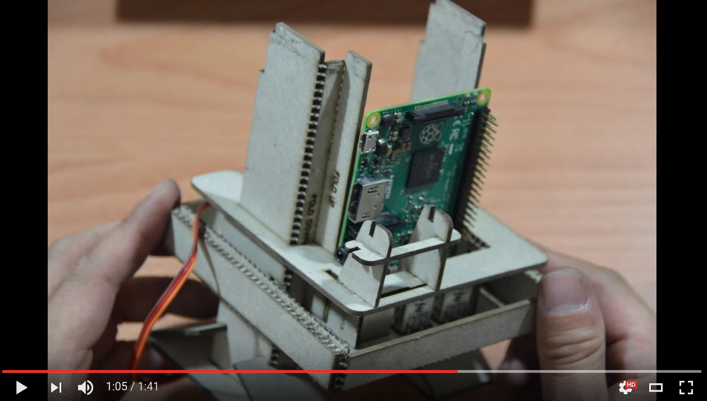
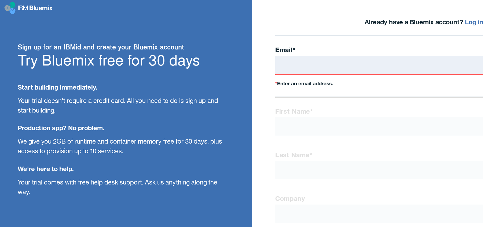
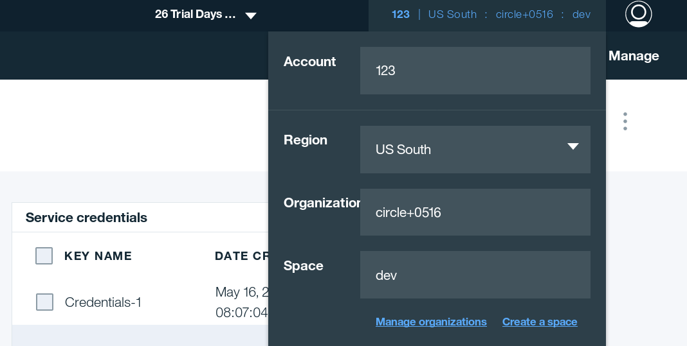
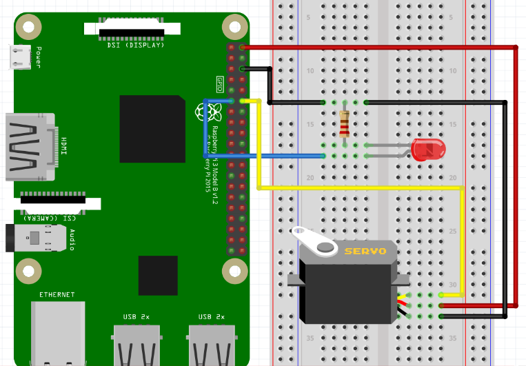

# This is cave-version tjbot

|  |  |
|-----------------------------|-------------------------------------|

## Preparation

### Material

1. Raspberry Pi
2. TJbot
3. SD card
4. Microphone
5. Speaker

### Assembly of TJbot


[youtube link](https://www.youtube.com/watch?v=MpL4BeQ3Nqc)

[Purchase info](http://shop.robotkingdom.com.tw/tjbot01.html)

### System Installation

The following steps are applicable on three main computer OS: Linux, macOS and Windows.

1. Download the latest image of [Raspian](https://www.raspberrypi.org/downloads/raspbian/).
2. Download the latest [Etcher](https://etcher.io/) to burn the image.
3. Burn the image to SD card and boot RPi.

### Basic config for RPi

Open terminal in RPi and type the following commands.

1. Update RPi system

```sh
sudo apt-get update
sudo apt-get dist-upgrade
```

2. Set the audio output to 3.5mm jack

```sh
sudo raspi-config
```
7 Advanced Options -> A4 Aduio -> 1 Force 3.5mm ('headphone') jack -> Ok

3. Install nodejs on RPi

```sh
curl -sL https://deb.nodesource.com/setup_7.x | sudo -E bash -
sudo apt-get install nodejs
```

4. (Optional) Install espeak for running tjdemo-espeak.js

```sh
sudo apt-get install espeak
```

5. Tune audio volume

```sh
alsamixer
```

Press \<Esc\> to exit.

## Prerequisite

### Register an IBM Bluemix account

Go to this [website](https://console.ng.bluemix.net/registration/) and register a new account.
Note that a new account is free for 30 days.



### Initialize the IBM bluemix

Log in to [Bluemix Web UI](console.ng.bluemix.net).

Set the *Region, Organization, Space*.

ex.



### Create the Speech-To-Text service

Create Service -> Watson -> Speech-To-Text-Service -> Plan: Standard

### Get the credential of STT service

Speech-To-Text service -> Service credntials -> New credential -> View credentials

ex.

```json
{
  "url": "https://stream.watsonplatform.net/speech-to-text/api",
  "username": "512e2a10-4411-4900-90af-947d0f339070",
  "password": "mUyesb3fl7oB"
}

```


### (Optional) Create Bluemix service in CLI

Install [Bluemix CLI(Cloud Foundry)](https://clis.ng.bluemix.net/ui/home.html)

Open the terminal in your computer(Command Prompt for Windows users).

```sh
cf login -a https://api.ng.bluemix.net
cf create-service speech_to_text standard my-stt-service
cf create-service-key my-stt-service
cf servic-key my-stt-service my-stt-key
```


## Usage 

1. Clone this project and change the working diretory into it.

```sh
git clone https://github.com/YuanYouYuan/cave-tjbot.git
cd cave-tjbot
```

2. Install node dependencies

```sh
npm install
```

3. Edit the credential in config.js

```sh
nano config.js
```

3. Run the sample code

```sh
sudo node tjdemo-google.js
```

## Scheme


